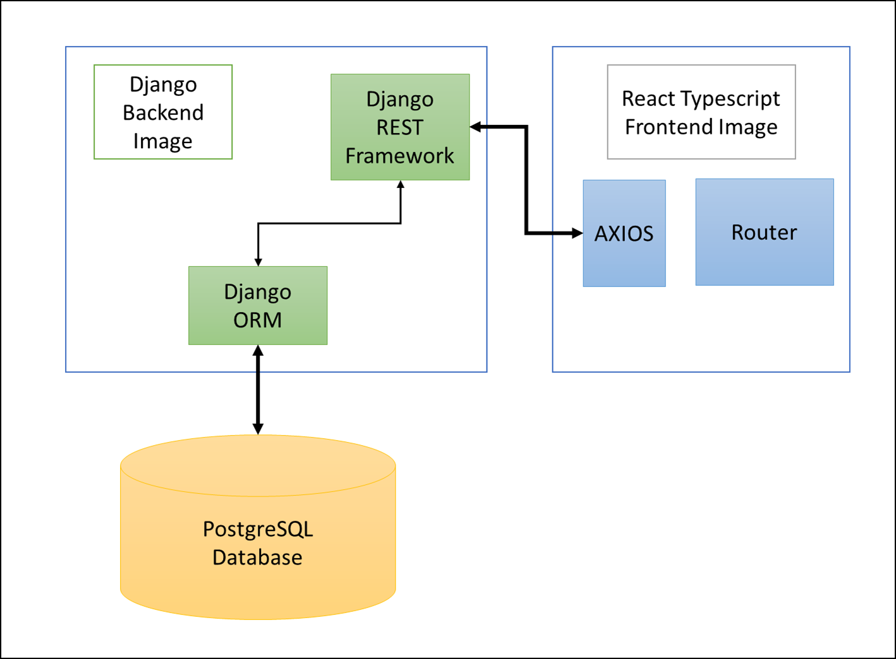

# Quantaco Assignment
Single Page for Streamlined Customer Object Management

### Setup Instructions
1. Create Virtual Environment with Python 3.8
2. Activate Virtual Environment
3. Install requirements use command `pip install -r requirements.txt`
4. Browse to Project directory: `cd SCOM`
5. Run migrations using `python manage.py migrate`
6. Create Superuser: `python manage.py createsuperuser` Provide username and password.
7. Run code locally, use command `python manage.py runserver`
8. Both frontend and backend will be hosted on the same port. Browse http://127.0.0.1:8000/
9. Login with credentials
10. Access Swagger UI (Open API Specification 3.0) from UI or browse http://127.0.0.1:8000/doc/

### Assumptions
1. Only authenticated user will be able to perform all the operations on Customer object.
2. All tasks including login and operations on Customer objects are to be perfromed only with REST APIs
3. User Authentication provides Access and Refresh Token which is stored in the session.
4. Used Django builtin sqlite3 database, can be updated.
5. Made sure all the operations are performed via Javascript API calls to simulate similar enviornment as both frontend and backend is made with django.

### Architerure

